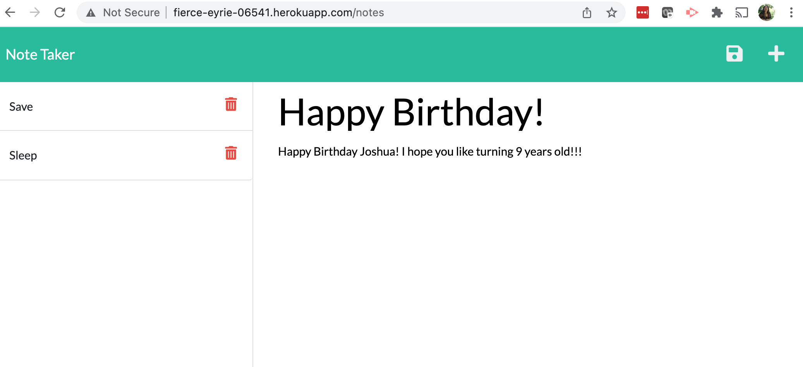

# noteTaker

## Description  

This is a live server project where a site starts on a landing page. It then takes you into a note page. On the note page, you can enter a note title and note text that you can then save it using the disk iocn. The note title will populate on the list at the left-hand side. 

## Table of Contents   

* [Installation](#installation)
* [Usage](#usage)
* [Build](#Built)
* [Credits](#credits)
* [Authors](#authors)
* [License](#license)
* [Questions](#questions)

## Installation

This project is a live site and does not require any installations. Check it out at [Live Note Taker website](http://fierce-eyrie-06541.herokuapp.com/)

## Usage 

[Note Taker LIVE website!](http://fierce-eyrie-06541.herokuapp.com/)

Here is a screenshot of someone adding in a Birthday Note

And here is the Birthday Note once it is saved. 

## Built With

* [HTML](https://developer.mozilla.org/en-US/docs/Web/HTML)
* [CSS](https://developer.mozilla.org/en-US/docs/Web/CSS)
* [Javascript](https://developer.mozilla.org/en-US/docs/Web/JavaScript)
* [Express NPM](https://expressjs.com/)
* [Heroku](https://dashboard.heroku.com)

## Credits

[NPM Express](https://expressjs.com/)

## Authors

* **Laura Gupta** 

- [Link to Portfolio Site](https://lauragupta.github.io/firstPortfolio/)
- [Link to Github](https://github.com/lauragupta?tab=repositories)
- [Link to LinkedIn](https://www.linkedin.com/in/laura-gupta-5a277158/)

## License
MIT License

Copyright (c) 2022 Laura Gupta

Permission is hereby granted, free of charge, to any person obtaining a copy
of this software and associated documentation files (the "Software"), to deal
in the Software without restriction, including without limitation the rights
to use, copy, modify, merge, publish, distribute, sublicense, and/or sell
copies of the Software, and to permit persons to whom the Software is
furnished to do so, subject to the following conditions:

The above copyright notice and this permission notice shall be included in all
copies or substantial portions of the Software.

THE SOFTWARE IS PROVIDED "AS IS", WITHOUT WARRANTY OF ANY KIND, EXPRESS OR
IMPLIED, INCLUDING BUT NOT LIMITED TO THE WARRANTIES OF MERCHANTABILITY,
FITNESS FOR A PARTICULAR PURPOSE AND NONINFRINGEMENT. IN NO EVENT SHALL THE
AUTHORS OR COPYRIGHT HOLDERS BE LIABLE FOR ANY CLAIM, DAMAGES OR OTHER
LIABILITY, WHETHER IN AN ACTION OF CONTRACT, TORT OR OTHERWISE, ARISING FROM,
OUT OF OR IN CONNECTION WITH THE SOFTWARE OR THE USE OR OTHER DEALINGS IN THE
SOFTWARE.

## Questions 
For questions, contact me at [GitHub](https://github.com/lauragupta) or email me at <codinglauragupta@gmail.com>
Thanks for reading!